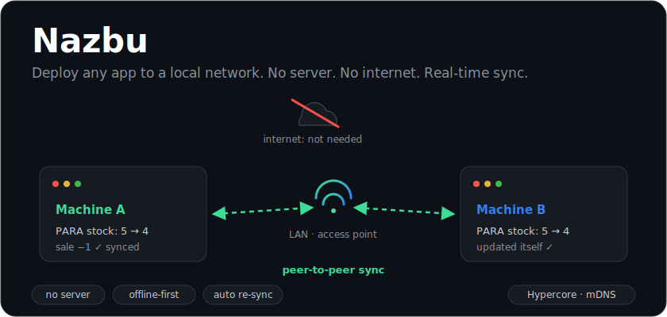
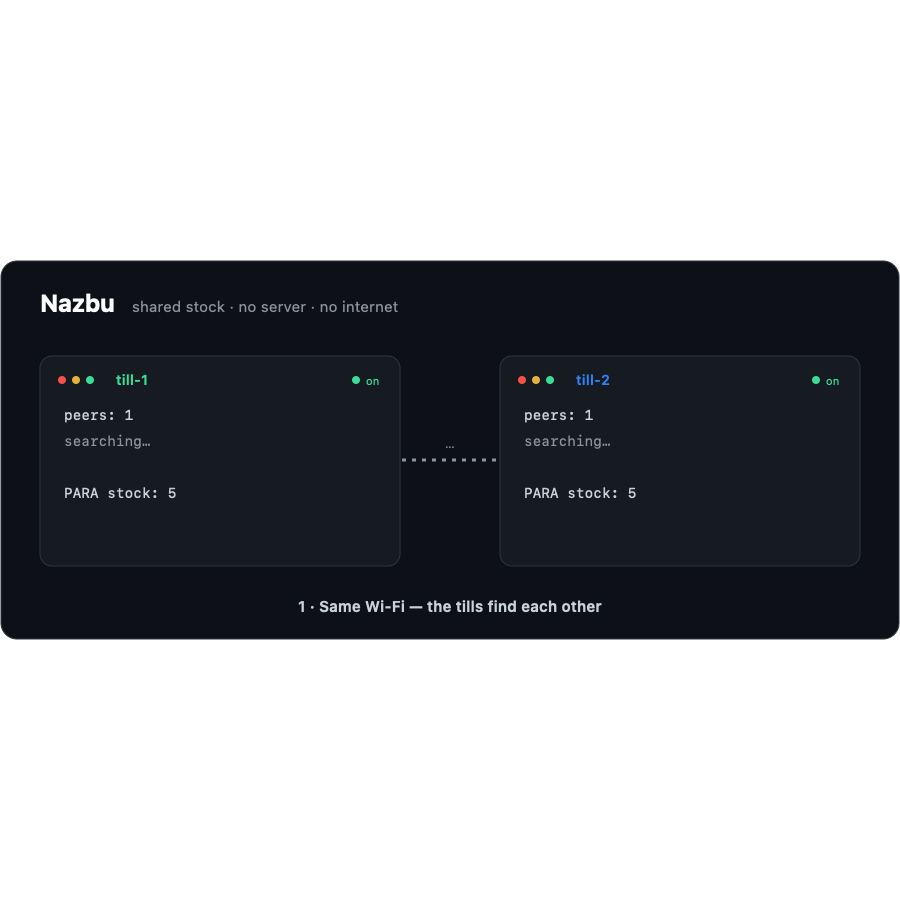

<div align="center">



# Nazbu

**Deploy any app to a local network, in one click. No server. No internet. Real-time P2P sync.**

[](LICENSE)
[](https://nodejs.org)
[](https://docs.pears.com/)
[](#how-it-works)
[](https://github.com/djabiridrissou/nazbu/stargazers)

**[→ Live site &amp; docs](https://djabiridrissou.github.io/nazbu/)**

</div>

---

> **Nazbu syncs. The [Hub](https://github.com/djabiridrissou/nazbu-hub) runs.** Nazbu is pure data
> sync — it doesn't touch your build. To make a whole app run *on-site* and offline (backend +
> database + local address + auto-update), pair it with its companion, **[Nazbu Hub](https://github.com/djabiridrissou/nazbu-hub)**.

---

## Sync a whole database — one line

Point Nazbu at the database you already have. It keeps that database offline-first and in sync
across every peer, with no server and no app change.

```js
const { Pool } = require('pg')
const Nazbu = require('nazbu')

const room = new Nazbu({
  db: new Pool({ connectionString: 'postgres://…/mydb' }),  // or a mongodb Db
  room: 'hospital-42',
  internet: true,
  policies: { sales: 'append-only', '*': 'last-writer-wins' }
})

await room.start()   // that database is now offline-first, on every node
```

Adapters: **[PostgreSQL](nazbu-postgres/)**, **[MySQL / MariaDB](nazbu-mysql/)** and **[MongoDB](nazbu-mongo/)**
ship today (`require('nazbu/postgres')`, `require('nazbu/mysql')`, `require('nazbu/mongo')`), or run any of
them as a zero-code sidecar (`npx nazbu-mysql --room … --uri …`).

---

Install the app on each machine, put them on the same access point, and everyone
is online together — instantly, with **no central server and no internet**
connection anywhere.

## Why

Most apps die the moment the internet drops. A pharmacy, a shop, a warehouse —
every till goes dark because a router upstream failed.

Nazbu flips it: the **local network is the backend**. Each machine carries its
own copy of the data, discovers its peers on the LAN, and keeps everyone in sync
in real time. When peers reconnect — even on a *different* network — they
catch up automatically. Internet becomes optional, used only to back up to the
cloud when it happens to be around.

## Demo

<div align="center">



*One sale updates both tills · Wi-Fi drops · reconnect → merged, no conflict.*

</div>

## Quickstart

```bash
git clone https://github.com/djabiridrissou/nazbu.git
cd nazbu && npm install
```

Run a demo on two machines on the same Wi-Fi (internet can be off):

```bash
node stock.js till-1      # machine 1
node stock.js till-2      # machine 2
```

Sell an item on one — the stock drops on **both**. Cut the Wi-Fi, sell on each
side, reconnect: everything reconciles by itself. No server was ever involved.

> **`peers` vs `linked`.** `peers` = machines *seen* on the network (mDNS).
> `linked` = machines actually *connected* and replicating. If you see
> `peers: 2  linked: 0`, they found each other but the data link is blocked —
> **allow `node` through the firewall on *both* machines**, and avoid "guest" /
> client-isolated Wi-Fi (a phone hotspot works great).

## Start a new app

```bash
npm create nazbu@latest my-app     # scaffolds a ready-to-run P2P app
cd my-app && npm install
node app.js alice                  # then on another machine: node app.js bob
```

*(Not on npm yet? Run it straight from this repo: `node create-nazbu/ my-app`.)*

## Use it as a library

The whole P2P/offline machinery hides behind a WebSocket-like API. Your app
never touches Hypercore:

```js
const Nazbu = require('nazbu')

const room = new Nazbu({ name: 'caisse-1', room: 'pharmacie-42' })

room.on('message', (data, meta) => {
  console.log(`from ${meta.from}:`, data)   // received from any peer on the LAN
})
room.on('peers', (count) => console.log('peers:', count))

await room.start()
room.send({ type: 'sale', total: 4500 })    // broadcast to everyone, no server
```

Messages are durable and re-sync automatically on reconnect. `send()` history is
replayed to fresh peers, so a machine that joins late catches up on everything.

**Rooms = isolation.** Only nodes in the same `room` discover and sync with each
other. Different apps, shops or tenants use different rooms and never cross-talk,
even on the same Wi-Fi — essential for multi-tenant apps like a chain of shops.

## Demos

| Demo | What it shows |
|------|---------------|
| `node nazbu.js <name>` | Shared counter — SPACE broadcasts +1 to every machine. |
| `node chat.js <name>`  | Real-time P2P chat, no server. |
| `node stock.js <name>` | The Womola model: sales as movement events → offline tills merge with **zero conflicts** and oversell surfaces as negative stock instead of a silently lost sale. |
| `node map.js [room]`   | Live network map — every machine in the room and whether it's actually connected (🟢) or just seen (🟡). Your first stop for debugging connectivity. |

## How it works

```
① Same network      A ⇄ B      in sync (events 1..7)
② Network drops     A   |   B   each keeps working locally, appends 8, 9, 10…
③ New network       A → 🔍 ← B  mDNS re-discovers peers automatically
④ Reconnect         A ⇄ B      "I'm missing 8,9,10" → exchanged → recombined
```

- **Discovery:** mDNS (link-local multicast) — needs a switch/access point, *not*
  the internet.
- **Data:** each node has its own append-only [Hypercore](https://docs.pears.com/)
  log; state is derived by replaying events.
- **Transport:** pluggable. `transports/lan-mdns.js` (LAN, no internet) and
  `transports/internet-swarm.js` (Hyperswarm/DHT, over the internet) — use both
  at once with `new Nazbu({ room, internet: true })`. Same core either way.
- **Conflicts:** model quantities as **movements/deltas** (commutative → merge for
  free); entity edits as last-write-wins. No coordinator, no primary.

## Offline shop, online boss

The real deployment: a shop with bad internet runs everything locally; the owner,
online elsewhere, still sees the data.

```
   SHOP (bad internet)                              BOSS (online)
   till-1 ─┐                                        ┌────────────┐
   till-2 ─┼─ LAN (mDNS) ─ always syncing ─┐        │ Nazbu node │
   till-3 ─┘                                └── internet (DHT) ──┤ (cloud/VPS)│
                       when internet blinks on, pushes up ───────┴────────────┘
```

Every node joins the same `room` with `internet: true`. Tills sync over the LAN
instantly; the moment any internet appears, they also reach the boss's node and
catch it up. No central server, nothing lost while offline.

## Roadmap

- **Phase 0 — Discovery + replication on LAN, offline.** ✅
- **Phase 1 — WebSocket-like API** (`index.js`). ✅
- **Phase 2 — `npm create nazbu`** CLI + template. ✅ (install page + npm publish next.)
- **Phase 3 — Flagship demo:** a real React + Node app synced over Nazbu, with
  its database as a local projection of the shared event log (non-invasive sidecar).

## License

[MIT](LICENSE) © Djabir
